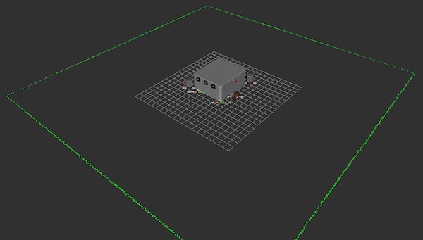
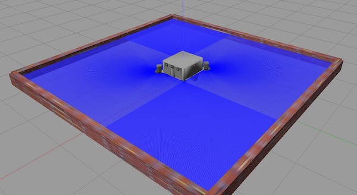
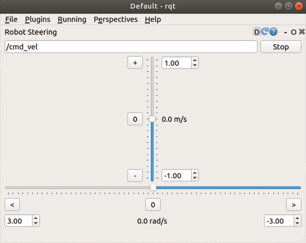

# Neobotix platforms used by the **Robotics & Automation Group** #

This repository contains the relevant ROS packages to run the Neobotix mobile platforms as standalone i.e. **the repository does NOT contain any robot arms**.

The packages have been tested with **ROS Melodic** and **Ubuntu 18.04.x LTS**.

## Table of Contents ##

- [About](#markdown-header-about)
- [Getting Started](#markdown-header-getting-started)
- [Usage](#markdown-header-usage)
- [Known Issues](#markdown-header-known-issues)
- [Authors & Maintainers](#markdown-header-authors-maintainers)

## About ##

The Neobotix platform exists in two configurations:

* `neo-aal`: laser scanners at the front and back
* `neo-cph`: laser scanners at diagonal corners

## Getting Started ##

### Install Dependencies ###

* [ROS Melodic](http://wiki.ros.org/melodic/Installation )
* Gazebo 9.x: Install the latest from http://gazebosim.org/tutorials?tut=install_ubuntu&cat=install

Check other dependencies with **rosdep**

```sh
$ rosdep check --from-paths . --ignore-src --rosdistro melodic
```

## Usage ##

### Test RViz, Gazebo and robot steering ###

Load robot_description and start rviz.

Arguments:

* `test` (BOOL): start rviz
* `platform_configuration`: load one of the two configurations

```sh
$ roslaunch neo_description neobotix.launch test:=true platform_configuration:=neo-cph
```


Start Gazebo to simulate the platform and sensors.

```sh
$ roslaunch neo_gazebo neobotix_5x5m_room.launch platform_configuration:=neo-cph
```



Start RQT to steer the mobile platform

* Add a Robot Steering panel: go to Plugins > Robot Tools > Robot Steering
* Move the sliders to send commands to /cmd_vel.

```sh
$ rqt
```




### Simulation using Gazebo ###

#### SLAM ####

* Launch Gazebo and load robot_description

```sh
$ roslaunch neo_gazebo neobotix_5x5m_room.launch platform_configuration:=neo-cph
```

* Launch SLAM

```sh
$ roslaunch neo_2dnav nav2dslam.launch
```

* Remote control the mobile platform

```sh
$ roslaunch neo_teleop teleop_keyboard.launch
```

* Save the map to the Home directory. The map will be saved as `map_name.yaml` and `map_name.pgm`.

```sh
$ rosrun map_server map_saver -f ~/map_name
```


## Known Issues ##

## Authors & Maintainers ##

* [Simon Bøgh](https://vbn.aau.dk/da/persons/118609)